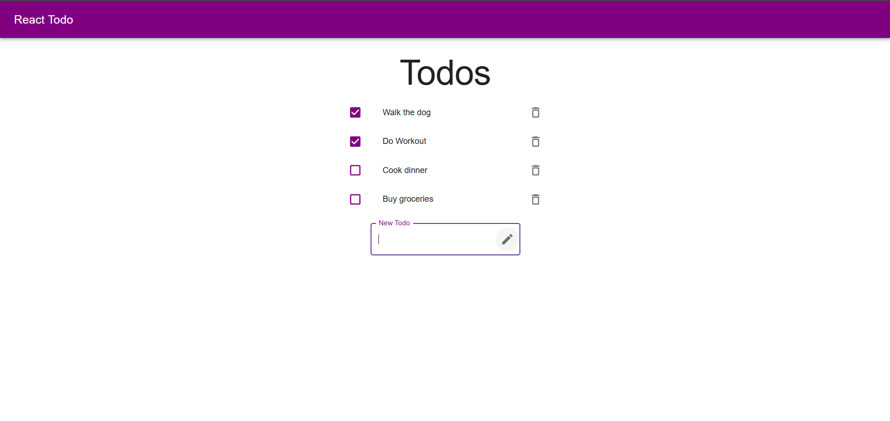

# 📝 React ToDo List App

A simple ToDo List application built with **React** and **Material-UI (MUI)**. Users can add, check/uncheck, and delete tasks. All tasks are stored in the browser's `localStorage`, so they persist across page reloads.

## 🚀 Features

- ✅ Add new todos
- 📋 View a list of todos
- ✔️ Check or uncheck completed todos
- ❌ Delete todos
- 💾 Persistent storage using `localStorage`
- 🎨 Clean and responsive UI using Material-UI

## 🖼️ Preview

 

## 🛠️ Technologies Used

- [React](https://reactjs.org/)
- [Material-UI](https://mui.com/)
- JavaScript (ES6+)
- HTML5 & CSS3
- localStorage for persistence

## 📦 Installation

1. **Clone the repository**
   ```bash
   git clone https://github.com/jeswindany/simple-todo-list.git
   cd simple-todo-list
   ```

2. **Install dependencies**
   ```bash
   npm install
   ```

3. **Start the development server**
   ```bash
   npm run dev
   ```

4. **Open http://localhost:5173/ to view the app in your browser.**


